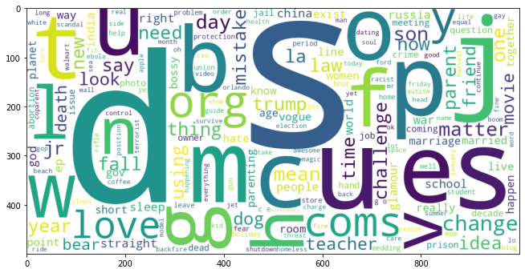
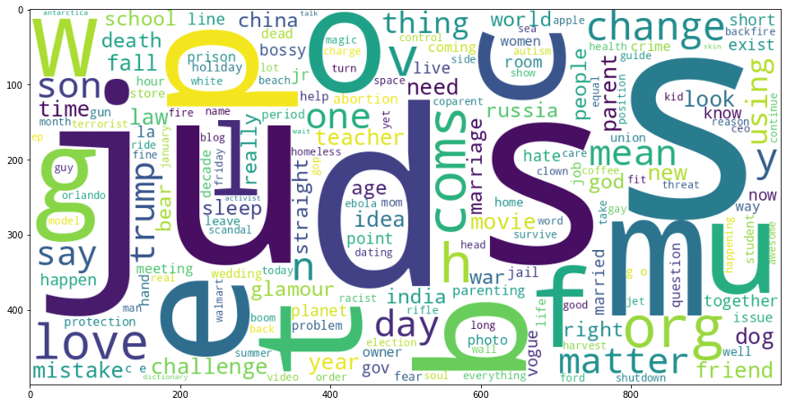
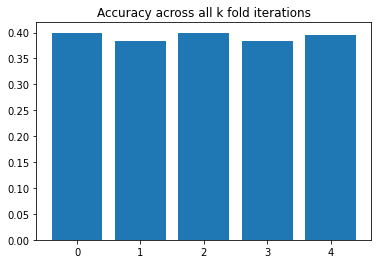
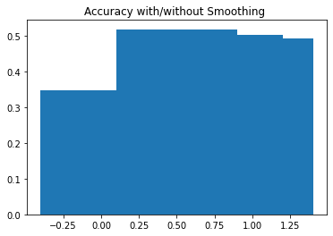

```python
import numpy as np
import matplotlib.pyplot as plt
import seaborn as sns
import wordcloud
import pandas as pd
import re as RegEx
```


    ---------------------------------------------------------------------------

    ModuleNotFoundError                       Traceback (most recent call last)

    Input In [1], in <cell line: 4>()
          2 import matplotlib.pyplot as plt
          3 import seaborn as sns
    ----> 4 import wordcloud
          5 import pandas as pd
          6 import re as RegEx


    ModuleNotFoundError: No module named 'wordcloud'


# Objective

The classification of news headlines is a critical responsibility for connecting people to the appropriate material. The classification of news headlines is a type of text classification that is divided into three parts: feature extraction, classifier selection, and evaluations. In this post, we use the Kaggle platform's dataset to identify news headlines over a period of time. We intend to apply the Naive Bayes algorithm to forecast the news category. In order to achieve the Final accuracy, we contrasted the accuracy of this naive bayes with smoothing.

## Methodology - Naive Bayes Classifier

A probabilistic machine learning model called a Naive Bayes classifier is utilised to perform classification tasks. Given that event B has occurred, the Bayes theorem provides us the conditional probability of event A.

<br />
$P(Category|Word) = \frac{P(Word|Category)P(Category)}{P(Word)}$

### Types of NBC:
#### Multinomial Naive Bayes -  Multiple classification
#### Bernoulli Naive Bayes:  - boolean variables.
#### Gaussian Naive Bayes -  values are sampled from a gaussian distribution

## Data Analysis
---

Now we will perform the following tasks on the given data

- Explore the aspects of given data 
- Clean up the missing variables 
- explore how many categories are there in the news dataset 
- Extract the relevant features from the set for analysis


```python
linFLag = True
df = pd.read_json('data.json', lines = linFLag)
```


```python
print(" ---- STATISTICS OF THE DATSET ------------")
print(" The Number of Data points : ", df.shape[0])
print(" Number of Categories : ", len(df.category.value_counts()))
print(" Number of Authors : ", len(df.authors.value_counts()))
```

     ---- STATISTICS OF THE DATSET ------------
     The Number of Data points :  200853
     Number of Categories :  41
     Number of Authors :  27993


Here we are interested in the headlines and the assosiated categories, So we will try to visualise the number of categories that are available in the given dataset. we wil use WORDCLOUD 


```python
from wordcloud import WordCloud
us=(" ").join(df.category.to_list())
wc = WordCloud( height = 467, width = 876,background_color='white').generate(us)
plt.figure(figsize=(15,8))
plt.imshow(wc)
plt.axis("off")
```


    (-0.5, 875.5, 466.5, -0.5)


    

    


## Analyse the words in the given Data
---

Extract all the words in the given data and then we will plot the word cloud of important words in the given data

- Convert all words into lower case
- Remove all Special Charecters from the words


```python
words = set()
for category,value in zip(df.category,df.headline):
    values = value.split(' ')
    values = list(map(str.lower,values))
    
    for k in values:
        ## Existing Values
        k = str(k)
        k_new = RegEx.sub('[^a-zA-Z0-9 \n\.]', '', k)
        words.add(k_new)

words = list(words)
us=(" ").join(words)
wordcloud = WordCloud( height = 500, width = 1000,background_color='white').generate(us)
plt.figure(figsize=(11,6))
plt.imshow(wordcloud)

```


    <matplotlib.image.AxesImage at 0x7f3a380b1a20>


    

    


## Remove Stopwords and then plot the keywords
---

Stopwords are English words that does not contribute significantly to a sentence's meaning. They can be ignored without jeopardising the meaning or context of the sentence. These words generally wil be removed from any analysis to make sure that they donot imapct the accuracy of the current model.


```python
words = set()
for category,value in zip(df.category,df.headline):
    values = value.split(' ')
    values = list(map(str.lower,values))
    
    for k in values:
        ## Existing Values
        k = str(k)
        k_new = RegEx.sub('[^a-zA-Z0-9 \n\.]', '', k)
        words.add(k_new)

STOPWORDS = ['just', 'not', 'her', 'has', 'to', 'their', 'it', 'himself', 'by', 'yourselves', 'nor', 'further', 'where', 'will', 'above', 'other', 'you', 'that', 'but', 'my', 'its', 's', 'because', 'she', 'before', 'at', 'below', 'such', 'had', 'each', 'who', 'them', 'no', 'both', 'your', 'did', 'him', 'is', 'about', 'what', 'from', 'being', 'his', 'again', 'while', 'more', 'or', 'whom', 't', 'be', 'am', 'now', 'ourselves', 'he', 'myself', 'for', 'this', 'themselves', 'hers', 'very', 'the', 'should', 'how', 'here', 'with', 'under', 'until', 'too', 'having', 'does', 'when', 'why', 'and', 'they', 'our', 'after', 'only', 'was', 'out', 'i', 'of', 'those', 'through', 'between', 'yours', 'doing', 'herself', 'me', 'once', 'most', 'off', 'a', 'do', 'we', 'into', 'up', 'if', 'any', 'all', 'which', 'than', 'don', 'in', 'own', 'on', 'as', 'so', 'were', 'same', 'ours', 'during', 'itself', 'are', 'some', 'theirs', 'then', 'can', 'yourself', 'been', 'over', 'against', 'these', 'have', 'there', 'few', 'down', 'an']
words = list(words)
newword = []
for word in words:
    if word not in STOPWORDS:
        if ( len(word) > 2):
            newword.append(word)

us=(" ").join(newword)
wordcloud = WordCloud( height = 500,width = 1000, background_color='white').generate(us)
plt.figure(figsize=(15,8))
plt.imshow(wordcloud)

```


    <matplotlib.image.AxesImage at 0x7f3a37e44240>


    

    


## Identify frequency for each word in each Category

Now we will identfy the frequency of each word in each category , this will be used to obtain the conditional probabilities


```python
def obtainFrequencyMatrix(df):

    wordDictionary = {}
    count = df['category'].value_counts()
    for category,value in zip(df.category,df.headline):
        values = value.split(' ')
        values = list(map(str.lower,values))

        for k in values:
            ## Existing Values
            k = str(k)
            k_new = RegEx.sub('[^a-zA-Z0-9 \n\.]', '', k)
            if( k_new not in wordDictionary ):
                wordDictionary[k_new] = {key: 0 for key, value in count.items()}

            wordDictionary[k_new][category] +=1;
    freqWords = pd.DataFrame(wordDictionary)
    return freqWords

freqMatrix = obtainFrequencyMatrix(df)
freqMatrix.head()
print(" NUmber of Unique Words : " ,  len(freqMatrix.columns))
totalLen = len(freqMatrix.columns)
```

     NUmber of Unique Words :  70458


### Removing Stop words


```python
## LEts remove all the Stop words from the given list 
for i in STOPWORDS:
    try :
        freqMatrix = freqMatrix.drop(i,axis=1)
    except KeyError:
        freqMatrix = freqMatrix;
print("Number of Unique Words : " ,  len(freqMatrix.columns))
print("Number of Stop words removed : " ,totalLen - len(freqMatrix.columns) )
```

     NUmber of Unique Words :  70331
    Number of Stop words removed :  127


## Compute the probability 

Conditional probability is a measure of the likelihood of an event occurring given that another event has previously occurred (via assumption, presumption, statement, or evidence). 


Here we will compute the probability of `P(word | category)` using the frequency matrix


```python
def ConditionalProbability(freqMatrix):
    Prob = freqMatrix.copy(deep=True)
    Prob = Prob.div(Prob.sum(axis=1), axis=0)
    
    return Prob
ConditionalProb = ConditionalProbability(freqMatrix)
ConditionalProb.head(5)
```


<div>
<style scoped>
    .dataframe tbody tr th:only-of-type {
        vertical-align: middle;
    }

    .dataframe tbody tr th {
        vertical-align: top;
    }

    .dataframe thead th {
        text-align: right;
    }
</style>
<table border="1" class="dataframe">
  <thead>
    <tr style="text-align: right;">
      <th></th>
      <th>2</th>
      <th>mass</th>
      <th>shootings</th>
      <th>texas</th>
      <th>last</th>
      <th>week</th>
      <th>1</th>
      <th>tv</th>
      <th>smith</th>
      <th>joins</th>
      <th>...</th>
      <th>gregoire</th>
      <th>nobbs</th>
      <th>tinker</th>
      <th>unsuitable</th>
      <th>allard</th>
      <th>hoorns</th>
      <th>songline</th>
      <th>aneesh</th>
      <th>thorsten</th>
      <th>heins</th>
    </tr>
  </thead>
  <tbody>
    <tr>
      <th>POLITICS</th>
      <td>0.000548</td>
      <td>0.000416</td>
      <td>0.000214</td>
      <td>0.001030</td>
      <td>0.000585</td>
      <td>0.000696</td>
      <td>0.000383</td>
      <td>0.000206</td>
      <td>0.000074</td>
      <td>0.000165</td>
      <td>...</td>
      <td>0.0</td>
      <td>0.0</td>
      <td>0.0</td>
      <td>0.000000</td>
      <td>0.0</td>
      <td>0.0</td>
      <td>0.0</td>
      <td>0.0</td>
      <td>0.0</td>
      <td>0.0</td>
    </tr>
    <tr>
      <th>WELLNESS</th>
      <td>0.001112</td>
      <td>0.000082</td>
      <td>0.000051</td>
      <td>0.000072</td>
      <td>0.000649</td>
      <td>0.000546</td>
      <td>0.001019</td>
      <td>0.000206</td>
      <td>0.000062</td>
      <td>0.000021</td>
      <td>...</td>
      <td>0.0</td>
      <td>0.0</td>
      <td>0.0</td>
      <td>0.000000</td>
      <td>0.0</td>
      <td>0.0</td>
      <td>0.0</td>
      <td>0.0</td>
      <td>0.0</td>
      <td>0.0</td>
    </tr>
    <tr>
      <th>ENTERTAINMENT</th>
      <td>0.002082</td>
      <td>0.000106</td>
      <td>0.000033</td>
      <td>0.000138</td>
      <td>0.000830</td>
      <td>0.000740</td>
      <td>0.000700</td>
      <td>0.001545</td>
      <td>0.000667</td>
      <td>0.000293</td>
      <td>...</td>
      <td>0.0</td>
      <td>0.0</td>
      <td>0.0</td>
      <td>0.000008</td>
      <td>0.0</td>
      <td>0.0</td>
      <td>0.0</td>
      <td>0.0</td>
      <td>0.0</td>
      <td>0.0</td>
    </tr>
    <tr>
      <th>TRAVEL</th>
      <td>0.000758</td>
      <td>0.000052</td>
      <td>0.000000</td>
      <td>0.000362</td>
      <td>0.000568</td>
      <td>0.000706</td>
      <td>0.000585</td>
      <td>0.000241</td>
      <td>0.000017</td>
      <td>0.000017</td>
      <td>...</td>
      <td>0.0</td>
      <td>0.0</td>
      <td>0.0</td>
      <td>0.000000</td>
      <td>0.0</td>
      <td>0.0</td>
      <td>0.0</td>
      <td>0.0</td>
      <td>0.0</td>
      <td>0.0</td>
    </tr>
    <tr>
      <th>STYLE &amp; BEAUTY</th>
      <td>0.000288</td>
      <td>0.000000</td>
      <td>0.000000</td>
      <td>0.000052</td>
      <td>0.000236</td>
      <td>0.008806</td>
      <td>0.000170</td>
      <td>0.000301</td>
      <td>0.000157</td>
      <td>0.000092</td>
      <td>...</td>
      <td>0.0</td>
      <td>0.0</td>
      <td>0.0</td>
      <td>0.000000</td>
      <td>0.0</td>
      <td>0.0</td>
      <td>0.0</td>
      <td>0.0</td>
      <td>0.0</td>
      <td>0.0</td>
    </tr>
  </tbody>
</table>
<p>5 rows × 70331 columns</p>
</div>


## TEST-TRAIN DATA SPLITUP
---
we need to beakup the given dataset into test, training and development dataset 


```python
Training, Test = np.split(df.sample (frac=1 ,random_state=32), 
                       [int(0.8*len(df))])
train_kfold, dev_kfold = np.split(Training.sample(frac=1, random_state=21), 
                       [int(.8*len(Training))])

print(" Testing Dataset  : " , Test.shape[0])
print(" Training Dataset : " , train_kfold.shape[0])
print(" Dev Dataset      : " , dev_kfold.shape[0])
```

     Testing Dataset  :  40171
     Training Dataset :  128545
     Dev Dataset      :  32137


### Encoding of output Data

we need to convert the categorical data of the output into an integer data using Encoding method. We will use dictionaries to encode the data


```python
def encodingLabels(ConditionalProb):
    CategoricalFeatures = ConditionalProb.index.to_list()
    PredictionDict = dict(zip(CategoricalFeatures,list(range(len(CategoricalFeatures))) ))
    return CategoricalFeatures,PredictionDict
```

### Word Extractor

This function will be to extract all the unique words in the system to a list for the prediction purposes


```python
def WordExtractor(dev_kfold):
    yActual = dev_kfold.category.to_list()
    STOPWORDS = ['is', 'how', 'says', '50', '5', 'as', 'this', 'on', 'my', 'of', 'may', 'not', 'what', 'after', 'why', 'for', 'its', 'at', 'from', 'her', 'you', 'will', '10', 'that', 'to', 'a', 'are', 'who', 'i', 'it', 'and', 'the', 'by', 'be', 'your', 'with', 'in']
    Y_test = []
    for line in dev_kfold.headline.to_list():
        lines = line.split(' ')
        values = list(map(str.lower,lines))
        newlist = [];
        for k in values:
            k = str(k);
            k_new = RegEx.sub('[^a-zA-Z0-9 \n\.]', '', k)
            if(k_new not in STOPWORDS):
                newlist.append(k_new)

        Y_test.append(newlist)
    
    return Y_test
```

### Bayes CLassifier

THis fucntion will perfrm the multiplication of the conditional probabilities and the prior probability in order to compute the prediction


```python
def BayesClassifier(Y_test,PREDICTIONLABEL,priorProbability,ConditionalProb):
    Y_pred = []

    for data in Y_test:
        probList = []
        for cat in PREDICTIONLABEL:
            probList.append(priorProbability[cat])
        probList = np.array(probList);
        for word in data:
            try:
                probList *= ConditionalProb[word].to_numpy()
            except KeyError:
                probList;
        Y_pred.append(probList)

    Y_pred_df = pd.DataFrame(Y_pred)
    
    return Y_pred_df
```

### Prior Probability
Computes the prior Probability


```python
def priorProbabilityCalc(df):
    count = df['category'].value_counts()
    priorProbability = {key: value for key, value in count.items()}
    for k,v in count.items():
        priorProbability[k] = v/train_kfold.shape[0]
    return priorProbability
```

### Freq Matrix


```python
def obtainFrequencyMatrix_new(df):

    wordDictionary = {}
    count = df['category'].value_counts()
    for category,value in zip(df.category,df.headline):
        values = value.split(' ')
        values = list(map(str.lower,values))

        for k in values:
            ## Existing Values
            k = str(k)
            k_new = RegEx.sub('[^a-zA-Z0-9 \n\.]', '', k)
            if( k_new not in wordDictionary ):
                wordDictionary[k_new] = {key: 0 for key, value in count.items()}

            wordDictionary[k_new][category] +=1;
    freqMatrix = pd.DataFrame(wordDictionary)
    STOPWORDS = ['is', 'how', 'says', '50', '5', 'as', 'this', 'on', 'my', 'of', 'may', 'not', 'what', 'after', 'why', 'for', 'its', 'at', 'from', 'her', 'you', 'will', '10', 'that', 'to', 'a', 'are', 'who', 'i', 'it', 'and', 'the', 'by', 'be', 'your', 'with', 'in']
    freqMatrix = freqMatrix.drop(STOPWORDS,axis=1)

    
    return freqMatrix
```

### Post processing - Error Metric

This will evaluate the accuracy metric for the classification after identifying all appropriate parameters


```python
def predictionAccuracy(Y_pred_df,PREDICTIONLABEL_DICT,yActual):
    prevSize = Y_pred_df.shape[0];
    ##Remvove the entries with zero probability , to compute accuracy
    Y_pred_df["idmax"] = Y_pred_df.idxmax(axis=1)
    Y_pred_df["sum"] = Y_pred_df.sum(axis=1)


    yPred_num = [];
    yActual_num = [];
    for i in range(len(yActual)):
    #     if(Y_pred_df["sum"][i] > 0):
        yActual_num.append(PREDICTIONLABEL_DICT[yActual[i]] )
        yPred_num.append(Y_pred_df["idmax"][i])

    from sklearn.metrics import accuracy_score, f1_score , precision_score

    return accuracy_score(yActual_num,yPred_num)
```

## CROSS VALIDATION 
 Cross-validation is  method of testing ML models that involves training numerous models on subsets of the available input data and then testing those on a different part of the data.The input data is divided into k subgroups during k-fold validation. All but one (k-1) of the subsets are used to train an ML model, which is then tested on the subset which was not used for training. .


```python
from sklearn.metrics import accuracy_score
def CrossValidation(Training,kfold):
    accuracyArray = []
    f1Array = []
    precisionArray = []
    for iterNum in range(kfold):
        print("Performing Cross Validation : " , iterNum)
        train_kfold, dev_kfold = \
                  np.split(Training.sample(frac=1, random_state=np.random.randint(0,100)), 
                           [int(.8*len(Training))])
        
        count = train_kfold['category'].value_counts()
        priorProbability = {key: value for key, value in count.items()}
        for k,v in count.items():
            priorProbability[k] = v/train_kfold.shape[0];
        
        wordList = []
        

        mainDictionary = {}
        for category,value in zip(train_kfold.category,train_kfold.headline):
            values = value.split(' ')
            values = list(map(str.lower,values))

            for k in values:
                ## Existing Values
                k = str(k)
                k_new = RegEx.sub('[^a-zA-Z0-9 \n\.]', '', k)
                if( k_new not in mainDictionary ):
                    mainDictionary[k_new] = {key: 0 for key, value in count.items()}

                mainDictionary[k_new][category] +=1;
                
        freqWords = pd.DataFrame(mainDictionary)
        avoidList = ['the', 'to', 'a','of','in','and','for','is','on','your','with','my','you','at','as','this','why','how','what','who','i','are','that']
        freqWords = freqWords.drop(avoidList,axis=1)
        ConditionalProb = freqWords.copy(deep=True)
        
        ConditionalProb = ConditionalProb.div(ConditionalProb.sum(axis=1), axis=0)
        
        yActual = dev_kfold.category.to_list()

        Y_test = []
        for line in dev_kfold.headline.to_list():
            lines = line.split(' ')
            values = list(map(str.lower,lines))
            newlist = [];
            for k in values:
                k = str(k);
                k_new = RegEx.sub('[^a-zA-Z0-9 \n\.]', '', k)
                if(k_new not in avoidList):
                    newlist.append(k_new)

            Y_test.append(newlist)
        
        Y_pred = []
        
        for data in Y_test:
            probList = []
            for cat in PREDICTIONLABEL:
                probList.append(priorProbability[cat])
            probList = np.array(probList);
            for word in data:
                try:
                    probList *= ConditionalProb[word].to_numpy()
                except KeyError:
                    probList;
            Y_pred.append(probList)
        
        Y_pred_df = pd.DataFrame(Y_pred)

        prevSize = Y_pred_df.shape[0];
#         print("Actual Size : " , prevSize)
        ##Remvove the entries with zero probability , to compute accuracy
        Y_pred_df["idmax"] = Y_pred_df.idxmax(axis=1)
        Y_pred_df["sum"] = Y_pred_df.sum(axis=1)


        yPred_num = [];
        yActual_num = [];
        for i in range(len(yActual)):
        #     if(Y_pred_df["sum"][i] > 0):
            yActual_num.append(PREDICTIONLABEL_DICT[yActual[i]] )
            yPred_num.append(Y_pred_df["idmax"][i])

        accuracyArray.append(accuracy_score(yActual_num,yPred_num))
        
        print("     Accuracy  : " , accuracyArray[iterNum])

    
    return accuracyArray
```

# Experimentation

Using the above functions, we will use them to perform the validation on our dev dataset. 


```python
accuracyArray = CrossValidation(Training,5)
```

    Performing Cross Validation :  0
         Accuracy  :  0.3996950555434546
    Performing Cross Validation :  1
         Accuracy  :  0.38454118306002427
    Performing Cross Validation :  2
         Accuracy  :  0.39966393876217443
    Performing Cross Validation :  3
         Accuracy  :  0.38454118306002427
    Performing Cross Validation :  4
         Accuracy  :  0.39512088869527334


```python
plt.bar([x for x in range(len(accuracyArray))],accuracyArray)
plt.title("Accuracy across all k fold iterations")
```


    Text(0.5, 1.0, 'Accuracy across all k fold iterations')


    

    


##  Smoothing
If query point contains a new observation, which is not yet seen in training data while calculating probabilities this will result in zero probability


```python
def crossValidationNaiveBayesWithSmoothing(Training,kfold,alpha,testFlag):
    accuracyArray = []
    f1Array = []
    precisionArray = []
    for iterNum in range(kfold):
        print("Performing Cross Validation : " , iterNum)
        train_kfold, dev_kfold = \
                  np.split(Training.sample(frac=1, random_state=np.random.randint(0,100)), 
                           [int(.8*len(Training))])
        count = train_kfold['category'].value_counts()
        priorProbability = {key: value for key, value in count.items()}
        for k,v in count.items():
            priorProbability[k] = v/train_kfold.shape[0];
        
        wordList = []
        

        mainDictionary = {}
        for category,value in zip(train_kfold.category,train_kfold.headline):
            values = value.split(' ')
            values = list(map(str.lower,values))

            for k in values:
                ## Existing Values
                k = str(k)
                k_new = RegEx.sub('[^a-zA-Z0-9 \n\.]', '', k)
                if( k_new not in mainDictionary ):
                    mainDictionary[k_new] = {key: 0 for key, value in count.items()}

                mainDictionary[k_new][category] +=1;
                
        freqWords = pd.DataFrame(mainDictionary)
        avoidList = ['the', 'to', 'a','of','in','and','for','is','on','your','with','my','you','at','as','this','why','how','what','who','i','are','that']
        freqWords = freqWords.drop(avoidList,axis=1)
        freqWords += alpha;
        ConditionalProb = freqWords.copy(deep=True)
        
        
        ConditionalProb = ConditionalProb.div(ConditionalProb.sum(axis=1) + len(PREDICTIONLABEL)*alpha, axis=0)
        
        yActual = dev_kfold.category.to_list()

        Y_test = []
        for line in dev_kfold.headline.to_list():
            lines = line.split(' ')
            values = list(map(str.lower,lines))
            newlist = [];
            for k in values:
                k = str(k);
                k_new = RegEx.sub('[^a-zA-Z0-9 \n\.]', '', k)
                if(k_new not in avoidList):
                    newlist.append(k_new)

            Y_test.append(newlist)
        
        Y_pred = []
        
        for data in Y_test:
            probList = []
            for cat in PREDICTIONLABEL:
                probList.append(priorProbability[cat])
            probList = np.array(probList);
            for word in data:
                try:
                    probList *= ConditionalProb[word].to_numpy()
                except KeyError:
                    probList *= np.ones_like(ConditionalProb.iloc[:,0])*(alpha/len(PREDICTIONLABEL));
            Y_pred.append(probList)
        
        Y_pred_df = pd.DataFrame(Y_pred)

        prevSize = Y_pred_df.shape[0];
#         print("Actual Size : " , prevSize)
        ##Remvove the entries with zero probability , to compute accuracy
        Y_pred_df["idmax"] = Y_pred_df.idxmax(axis=1)
        Y_pred_df["sum"] = Y_pred_df.sum(axis=1)


        yPred_num = [];
        yActual_num = [];
        for i in range(len(yActual)):
        #     if(Y_pred_df["sum"][i] > 0):
            yActual_num.append(PREDICTIONLABEL_DICT[yActual[i]] )
            yPred_num.append(Y_pred_df["idmax"][i])

        accuracyArray.append(accuracy_score(yActual_num,yPred_num))

        print("     Accuracy  : " , accuracyArray[iterNum])

    
    return sum(accuracyArray)/len(accuracyArray)
```


```python
Alpha  = [0,0.5,0.8,0.9,1,10]

results = {}
for i in Alpha:
    results[i] = crossValidationNaiveBayesWithSmoothing(Training,5,i)
```

    Performing Cross Validation :  0
         Accuracy  :  0.3592121230979867
    Performing Cross Validation :  1
         Accuracy  :  0.35606932818869214
    Performing Cross Validation :  2
         Accuracy  :  0.31611538102498676
    Performing Cross Validation :  3
         Accuracy  :  0.3441204841771167
    Performing Cross Validation :  4
         Accuracy  :  0.36559106326041635
    Performing Cross Validation :  0
         Accuracy  :  0.5255935526029187
    Performing Cross Validation :  1
         Accuracy  :  0.5246600491645145
    Performing Cross Validation :  2
         Accuracy  :  0.5246600491645145
    Performing Cross Validation :  3
         Accuracy  :  0.5162896350001556
    Performing Cross Validation :  4
         Accuracy  :  0.500233375859601
    Performing Cross Validation :  0
         Accuracy  :  0.5049942433954632
    Performing Cross Validation :  1
         Accuracy  :  0.4997666241403989
    Performing Cross Validation :  2
         Accuracy  :  0.4900270715997137
    Performing Cross Validation :  3
         Accuracy  :  0.5060833307402682
    Performing Cross Validation :  4
         Accuracy  :  0.5078881040545166
    Performing Cross Validation :  0
         Accuracy  :  0.48476833556336935
    Performing Cross Validation :  1
         Accuracy  :  0.48178112456047545
    Performing Cross Validation :  2
         Accuracy  :  0.48137660640383356
    Performing Cross Validation :  3
         Accuracy  :  0.5022870834240906
    Performing Cross Validation :  4
         Accuracy  :  0.4874132619721816
    Performing Cross Validation :  0
         Accuracy  :  0.4908361079129975
    Performing Cross Validation :  1
         Accuracy  :  0.498708653576874
    Performing Cross Validation :  2
         Accuracy  :  0.48504838659489063
    Performing Cross Validation :  3
         Accuracy  :  0.4943523041976538
    Performing Cross Validation :  4
         Accuracy  :  0.4975573326695087
    Performing Cross Validation :  0
         Accuracy  :  0.3659644646357781
    Performing Cross Validation :  1
         Accuracy  :  0.3663067492298597
    Performing Cross Validation :  2
         Accuracy  :  0.3663067492298597
    Performing Cross Validation :  3
         Accuracy  :  0.3445250023337586
    Performing Cross Validation :  4
         Accuracy  :  0.3614836481314373


```python
resultsNew = results
resultsNew.pop(10,None)
plt.bar(*zip(*results.items()))
plt.title("Accuracy with/without Smoothing ")
```


    Text(0.5, 1.0, 'Accuracy with/without Smoothing ')


    

    


## Accuracy on the Testing Data 

Now we will test the accuracy on the testing data 


```python
def crossValidationNaiveBayesWithSmoothing_test(train,PropConst,alpha):
    train_kfold =  train
    count = train_kfold['category'].value_counts()
    priorProbability = {key: value for key, value in count.items()}
    for k,v in count.items():
        priorProbability[k] = v/train_kfold.shape[0];

    wordList = []


    mainDictionary = {}
    for category,value in zip(train_kfold.category,train_kfold.headline):
        values = value.split(' ')
        values = list(map(str.lower,values))

        for k in values:
            ## Existing Values
            k = str(k)
            k_new = RegEx.sub('[^a-zA-Z0-9 \n\.]', '', k)
            if( k_new not in mainDictionary ):
                mainDictionary[k_new] = {key: 0 for key, value in count.items()}

            mainDictionary[k_new][category] +=1;

    freqWords = pd.DataFrame(mainDictionary)
    avoidList = ['the', 'to', 'a','of','in','and','for','is','on','your','with','my','you','at','as','this','why','how','what','who','i','are','that']
    freqWords = freqWords.drop(avoidList,axis=1)
    freqWords += alpha;
    ConditionalProb = freqWords.copy(deep=True)


    ConditionalProb = ConditionalProb.div(ConditionalProb.sum(axis=1) + len(PREDICTIONLABEL)*alpha, axis=0)

    yActual = dev_kfold.category.to_list()

    Y_test = []
    for line in dev_kfold.headline.to_list():
        lines = line.split(' ')
        values = list(map(str.lower,lines))
        newlist = [];
        for k in values:
            k = str(k);
            k_new = RegEx.sub('[^a-zA-Z0-9 \n\.]', '', k)
            if(k_new not in avoidList):
                newlist.append(k_new)

        Y_test.append(newlist)

    Y_pred = []
    
    for data in Y_test:
        probList = []
        for cat in PREDICTIONLABEL:
            probList.append(priorProbability[cat]*PropConst)
        probList = np.array(probList);
        for word in data:
            try:
                probList *= ConditionalProb[word].to_numpy()
            except KeyError:
                probList *= np.ones_like(ConditionalProb.iloc[:,0])*(alpha/len(PREDICTIONLABEL));
        Y_pred.append(probList)

    Y_pred_df = pd.DataFrame(Y_pred)

    prevSize = Y_pred_df.shape[0];
#         print("Actual Size : " , prevSize)
    ##Remvove the entries with zero probability , to compute accuracy
    Y_pred_df["idmax"] = Y_pred_df.idxmax(axis=1)
    Y_pred_df["sum"] = Y_pred_df.sum(axis=1)


    yPred_num = [];
    yActual_num = [];
    for i in range(len(yActual)):
    #     if(Y_pred_df["sum"][i] > 0):
        yActual_num.append(PREDICTIONLABEL_DICT[yActual[i]] )
        yPred_num.append(Y_pred_df["idmax"][i])


    print("     Accuracy  : " ,accuracy_score(yActual_num,yPred_num))
#         print("     Precision : " , precisionArray[iterNum])
#         print("     F1        : " , f1Array[iterNum])

    return accuracy_score(yActual_num,yPred_num)
```


```python
accuracy = crossValidationNaiveBayesWithSmoothing_test(Test,10,1)
print(" The final accuracy of our model is : " , accuracy*100 , " % ")
```

         Accuracy  :  0.42689112238230076
     The final accuracy of our model is :  42.689112238230074  % 


##  common words in each category


```python
wordList = []
import re

count = Training['category'].value_counts()
mainDictionary = {}
for category,value in zip(df.category,df.headline):
    values = value.split(' ')
    values = list(map(str.lower,values))
    
    for k in values:
        ## Existing Values
        k = str(k)
        k_new = re.sub('[^a-zA-Z0-9 \n\.]', '', k)
        if( k_new not in mainDictionary ):
            mainDictionary[k_new] = {key: 0 for key, value in count.items()}
        
        mainDictionary[k_new][category] +=1;

freqWords = pd.DataFrame(mainDictionary)
avoidList = ['the', 'to', 'a','of','in','and','for','is','on','your','with','my','you','at','as',\
             'after','her','may','this','why','how','what','who','i','are','that','be','it','from','its','not','will','says','by','5','10','50']
freqWords = freqWords.drop(avoidList,axis=1)
freqWords += 1;
ConditionalProb = freqWords.copy(deep=True)


ConditionalProb = ConditionalProb.div(ConditionalProb.sum(axis=1) + len(PREDICTIONLABEL)*1, axis=0)
nlargest = 10
order = np.argsort(-ConditionalProb.values, axis=1)[:, :nlargest]
result = pd.DataFrame(ConditionalProb.columns[order], 
                      columns=['top{}'.format(i) for i in range(1, nlargest+1)],
                      index=ConditionalProb.index)

```

    /usr/local/lib/python3.6/dist-packages/ipykernel_launcher.py:29: DeprecationWarning: Support for multi-dimensional indexing (e.g. `index[:, None]`) on an Index is deprecated and will be removed in a future version.  Convert to a numpy array before indexing instead.


```python
result
```


<div>
<style scoped>
    .dataframe tbody tr th:only-of-type {
        vertical-align: middle;
    }

    .dataframe tbody tr th {
        vertical-align: top;
    }

    .dataframe thead th {
        text-align: right;
    }
</style>
<table border="1" class="dataframe">
  <thead>
    <tr style="text-align: right;">
      <th></th>
      <th>top1</th>
      <th>top2</th>
      <th>top3</th>
      <th>top4</th>
      <th>top5</th>
      <th>top6</th>
      <th>top7</th>
      <th>top8</th>
      <th>top9</th>
      <th>top10</th>
    </tr>
  </thead>
  <tbody>
    <tr>
      <th>POLITICS</th>
      <td>trump</td>
      <td>donald</td>
      <td>trumps</td>
      <td>gop</td>
      <td>clinton</td>
      <td>about</td>
      <td>obama</td>
      <td>hillary</td>
      <td>new</td>
      <td>his</td>
    </tr>
    <tr>
      <th>WELLNESS</th>
      <td>study</td>
      <td>health</td>
      <td>life</td>
      <td>can</td>
      <td>cancer</td>
      <td>sleep</td>
      <td>new</td>
      <td>do</td>
      <td>could</td>
      <td>more</td>
    </tr>
    <tr>
      <th>ENTERTAINMENT</th>
      <td>new</td>
      <td>about</td>
      <td>his</td>
      <td>trump</td>
      <td></td>
      <td>star</td>
      <td>first</td>
      <td>out</td>
      <td>movie</td>
      <td>up</td>
    </tr>
    <tr>
      <th>TRAVEL</th>
      <td>photos</td>
      <td>travel</td>
      <td>best</td>
      <td>new</td>
      <td>world</td>
      <td>most</td>
      <td>video</td>
      <td>hotel</td>
      <td></td>
      <td>hotels</td>
    </tr>
    <tr>
      <th>STYLE &amp; BEAUTY</th>
      <td>photos</td>
      <td>fashion</td>
      <td>style</td>
      <td></td>
      <td>week</td>
      <td>video</td>
      <td>photo</td>
      <td>more</td>
      <td>new</td>
      <td>dress</td>
    </tr>
    <tr>
      <th>PARENTING</th>
      <td>kids</td>
      <td>parents</td>
      <td>video</td>
      <td>baby</td>
      <td>mom</td>
      <td>about</td>
      <td>children</td>
      <td>parenting</td>
      <td>day</td>
      <td>moms</td>
    </tr>
    <tr>
      <th>HEALTHY LIVING</th>
      <td>health</td>
      <td>about</td>
      <td>can</td>
      <td>life</td>
      <td>more</td>
      <td>ways</td>
      <td>sleep</td>
      <td>new</td>
      <td>when</td>
      <td>people</td>
    </tr>
    <tr>
      <th>QUEER VOICES</th>
      <td>gay</td>
      <td>new</td>
      <td>queer</td>
      <td>lgbt</td>
      <td>trans</td>
      <td>about</td>
      <td>out</td>
      <td>transgender</td>
      <td>lgbtq</td>
      <td>marriage</td>
    </tr>
    <tr>
      <th>FOOD &amp; DRINK</th>
      <td>recipes</td>
      <td>photos</td>
      <td>best</td>
      <td>food</td>
      <td>recipe</td>
      <td>day</td>
      <td>make</td>
      <td>video</td>
      <td></td>
      <td>new</td>
    </tr>
    <tr>
      <th>BUSINESS</th>
      <td>business</td>
      <td>women</td>
      <td>wall</td>
      <td></td>
      <td>new</td>
      <td>about</td>
      <td>most</td>
      <td>ceo</td>
      <td>247</td>
      <td>st.</td>
    </tr>
    <tr>
      <th>COMEDY</th>
      <td>trump</td>
      <td>donald</td>
      <td>video</td>
      <td>jimmy</td>
      <td>colbert</td>
      <td>trumps</td>
      <td>snl</td>
      <td>stephen</td>
      <td>bill</td>
      <td>maher</td>
    </tr>
    <tr>
      <th>SPORTS</th>
      <td>nfl</td>
      <td>video</td>
      <td>game</td>
      <td>world</td>
      <td>his</td>
      <td>football</td>
      <td>olympic</td>
      <td>team</td>
      <td>player</td>
      <td>nba</td>
    </tr>
    <tr>
      <th>BLACK VOICES</th>
      <td>black</td>
      <td>new</td>
      <td>police</td>
      <td>about</td>
      <td>white</td>
      <td>his</td>
      <td>photos</td>
      <td>more</td>
      <td></td>
      <td>video</td>
    </tr>
    <tr>
      <th>HOME &amp; LIVING</th>
      <td>photos</td>
      <td>home</td>
      <td>video</td>
      <td>ideas</td>
      <td>day</td>
      <td>house</td>
      <td>make</td>
      <td>diy</td>
      <td>craft</td>
      <td>new</td>
    </tr>
    <tr>
      <th>PARENTS</th>
      <td>kids</td>
      <td>mom</td>
      <td>parents</td>
      <td>about</td>
      <td>moms</td>
      <td>baby</td>
      <td>parenting</td>
      <td>dad</td>
      <td>their</td>
      <td>day</td>
    </tr>
    <tr>
      <th>THE WORLDPOST</th>
      <td>u.s.</td>
      <td>attack</td>
      <td>trump</td>
      <td>isis</td>
      <td>syria</td>
      <td>north</td>
      <td>korea</td>
      <td>new</td>
      <td>over</td>
      <td>syrian</td>
    </tr>
    <tr>
      <th>WEDDINGS</th>
      <td>wedding</td>
      <td>marriage</td>
      <td>photos</td>
      <td>video</td>
      <td>weddings</td>
      <td>day</td>
      <td>couples</td>
      <td>married</td>
      <td>proposal</td>
      <td></td>
    </tr>
    <tr>
      <th>WOMEN</th>
      <td>women</td>
      <td>about</td>
      <td>woman</td>
      <td>womens</td>
      <td>tweets</td>
      <td>sexual</td>
      <td>men</td>
      <td>week</td>
      <td>funniest</td>
      <td>trump</td>
    </tr>
    <tr>
      <th>IMPACT</th>
      <td>day</td>
      <td>world</td>
      <td></td>
      <td>homeless</td>
      <td>help</td>
      <td>can</td>
      <td>we</td>
      <td>new</td>
      <td>women</td>
      <td>our</td>
    </tr>
    <tr>
      <th>DIVORCE</th>
      <td>divorce</td>
      <td>marriage</td>
      <td></td>
      <td>divorced</td>
      <td>about</td>
      <td>video</td>
      <td>single</td>
      <td>ex</td>
      <td>dating</td>
      <td>when</td>
    </tr>
    <tr>
      <th>CRIME</th>
      <td>police</td>
      <td>man</td>
      <td>shooting</td>
      <td>cops</td>
      <td>killed</td>
      <td>dead</td>
      <td>allegedly</td>
      <td>suspect</td>
      <td>woman</td>
      <td>accused</td>
    </tr>
    <tr>
      <th>MEDIA</th>
      <td>trump</td>
      <td>news</td>
      <td>new</td>
      <td>fox</td>
      <td>media</td>
      <td>donald</td>
      <td>over</td>
      <td>times</td>
      <td>about</td>
      <td>york</td>
    </tr>
    <tr>
      <th>WEIRD NEWS</th>
      <td>man</td>
      <td>watch</td>
      <td>out</td>
      <td>into</td>
      <td>his</td>
      <td>woman</td>
      <td>police</td>
      <td>dog</td>
      <td>new</td>
      <td>cops</td>
    </tr>
    <tr>
      <th>GREEN</th>
      <td>climate</td>
      <td>change</td>
      <td></td>
      <td>dog</td>
      <td>california</td>
      <td>new</td>
      <td>we</td>
      <td>our</td>
      <td>more</td>
      <td>about</td>
    </tr>
    <tr>
      <th>WORLDPOST</th>
      <td>isis</td>
      <td>u.s.</td>
      <td>world</td>
      <td>new</td>
      <td>war</td>
      <td>iran</td>
      <td>china</td>
      <td>israel</td>
      <td>ukraine</td>
      <td></td>
    </tr>
    <tr>
      <th>RELIGION</th>
      <td>pope</td>
      <td>francis</td>
      <td>meditation</td>
      <td>daily</td>
      <td>church</td>
      <td>muslim</td>
      <td>new</td>
      <td>religious</td>
      <td>faith</td>
      <td>about</td>
    </tr>
    <tr>
      <th>STYLE</th>
      <td>fashion</td>
      <td>new</td>
      <td>beauty</td>
      <td>best</td>
      <td>style</td>
      <td>week</td>
      <td>all</td>
      <td>dress</td>
      <td>hair</td>
      <td>we</td>
    </tr>
    <tr>
      <th>WORLD NEWS</th>
      <td>north</td>
      <td>korea</td>
      <td>u.s.</td>
      <td>trump</td>
      <td>new</td>
      <td>attack</td>
      <td>south</td>
      <td>over</td>
      <td>crisis</td>
      <td>police</td>
    </tr>
    <tr>
      <th>SCIENCE</th>
      <td>new</td>
      <td>space</td>
      <td>scientists</td>
      <td>video</td>
      <td>study</td>
      <td>science</td>
      <td>nasa</td>
      <td>shows</td>
      <td>earth</td>
      <td></td>
    </tr>
    <tr>
      <th>TECH</th>
      <td>apple</td>
      <td>facebook</td>
      <td>new</td>
      <td>google</td>
      <td>iphone</td>
      <td>week</td>
      <td>watch</td>
      <td>twitter</td>
      <td>tech</td>
      <td>can</td>
    </tr>
    <tr>
      <th>TASTE</th>
      <td>recipes</td>
      <td>make</td>
      <td>food</td>
      <td>best</td>
      <td>new</td>
      <td></td>
      <td>day</td>
      <td>can</td>
      <td>all</td>
      <td>summer</td>
    </tr>
    <tr>
      <th>MONEY</th>
      <td>money</td>
      <td>credit</td>
      <td>tax</td>
      <td>financial</td>
      <td>more</td>
      <td>ways</td>
      <td>can</td>
      <td>about</td>
      <td>debt</td>
      <td>new</td>
    </tr>
    <tr>
      <th>ARTS</th>
      <td>art</td>
      <td>artist</td>
      <td></td>
      <td>new</td>
      <td>an</td>
      <td>first</td>
      <td>nighter</td>
      <td>artists</td>
      <td>world</td>
      <td>these</td>
    </tr>
    <tr>
      <th>GOOD NEWS</th>
      <td>his</td>
      <td>dog</td>
      <td>man</td>
      <td>boy</td>
      <td>up</td>
      <td>homeless</td>
      <td>these</td>
      <td>life</td>
      <td>watch</td>
      <td>woman</td>
    </tr>
    <tr>
      <th>FIFTY</th>
      <td>about</td>
      <td>life</td>
      <td>things</td>
      <td>when</td>
      <td>retirement</td>
      <td>ways</td>
      <td></td>
      <td>we</td>
      <td>7</td>
      <td>should</td>
    </tr>
    <tr>
      <th>ARTS &amp; CULTURE</th>
      <td>art</td>
      <td>new</td>
      <td>book</td>
      <td>artist</td>
      <td>trump</td>
      <td>about</td>
      <td>artists</td>
      <td>women</td>
      <td>an</td>
      <td>his</td>
    </tr>
    <tr>
      <th>ENVIRONMENT</th>
      <td>photos</td>
      <td>week</td>
      <td>video</td>
      <td>climate</td>
      <td>animal</td>
      <td>change</td>
      <td>more</td>
      <td>new</td>
      <td>weather</td>
      <td>day</td>
    </tr>
    <tr>
      <th>COLLEGE</th>
      <td>college</td>
      <td>students</td>
      <td>university</td>
      <td>student</td>
      <td>sexual</td>
      <td>campus</td>
      <td>colleges</td>
      <td>assault</td>
      <td>rape</td>
      <td>about</td>
    </tr>
    <tr>
      <th>LATINO VOICES</th>
      <td>latino</td>
      <td>latinos</td>
      <td>trump</td>
      <td>about</td>
      <td>puerto</td>
      <td>new</td>
      <td>latina</td>
      <td>u.s.</td>
      <td>immigrants</td>
      <td>up</td>
    </tr>
    <tr>
      <th>EDUCATION</th>
      <td>education</td>
      <td>school</td>
      <td></td>
      <td>teachers</td>
      <td>schools</td>
      <td>students</td>
      <td>teacher</td>
      <td>about</td>
      <td>global</td>
      <td>student</td>
    </tr>
    <tr>
      <th>CULTURE &amp; ARTS</th>
      <td>photos</td>
      <td>art</td>
      <td>imageblog</td>
      <td></td>
      <td>week</td>
      <td>video</td>
      <td>new</td>
      <td>artist</td>
      <td>arts</td>
      <td>birthday</td>
    </tr>
  </tbody>
</table>
</div>


# References
- https://medium.com/analytics-vidhya/intuition-behind-naive-bayes-algorithm-laplace-additive-smoothing-e2cb43a82901
- https://faculty.cc.gatech.edu/~bboots3/CS4641-Fall2018/Lecture10/10_NaiveBayes.pdf
- https://stats.stackexchange.com/questions/108797/in-naive-bayes-why-bother-with-laplace-smoothing-when-we-have-unknown-words-in
- https://www.kaggle.com/datasets/rmisra/news-category-dataset


```python

```
